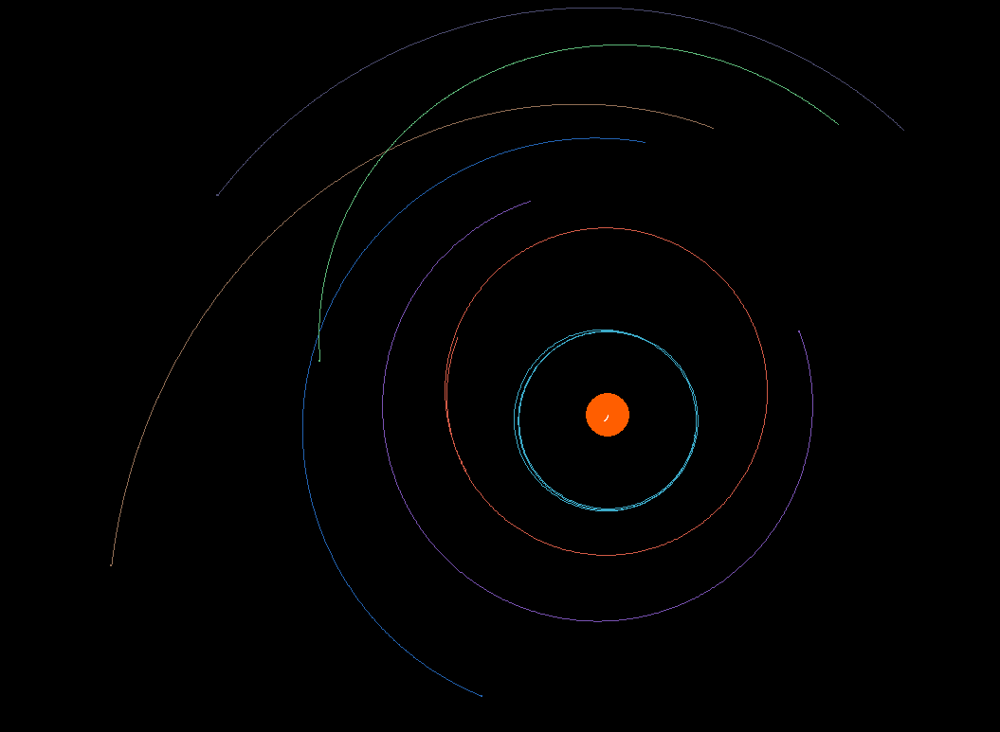

# N-Body Orbital Physics Simulator

---

## What is it?

This project is a custom 2D physics engine designed to simulate stable, procedurally generated solar systems. It also handles N-body physics with plug-and-play integrators (currently only Euler and Verlet).

## Best features

* **True N-Body Gravity:** Every body exerts gravitational force on every other body in the system.
* **Physics-Based Procedural Generation:** Generates random solar systems with strict rules (like minimum orbital spacing/Hill radius and strict mass ratios). This is to prevent the system from turning into a binary one instantly!
* **Momentum Balancing:** Calculates the total momentum of generated planets to apply the exact opposite momentum to the star. This keeps the absolute center of mass perfectly still at the start.
* **Live Debug Visualization:** Renders gravitational force vectors and distance checks in real-time to visualize the underlying math of the n-body interactions.

---

## Advanced Physics Implementation

Building a stable n-body simulation requires more than just applying standard orbital equations. To ensure long-term stability and prevent the simulation from breaking due to edge-case physics, this engine implements several advanced techniques:

### 1. Symplectic Integration (Velocity Verlet)

Standard Euler integration (`position += velocity * dt`) is notoriously unstable for orbital mechanics because it overestimates trajectories, artificially adding energy to the system every frame and causing orbits to slowly spiral outward.

To solve this, the engine also has a **Velocity Verlet** implementation. Velocity Verlet is a symplectic integrator that calculates a half-step position to determine the next frame's acceleration. This inherently conserves the system's total energy, allowing for perfectly stable, non-degrading orbits over long periods of time.

### 2. Gravitational Softening Parameter ($\epsilon$)

In standard Newtonian physics, the force of gravity is inversely proportional to the distance squared ($r^2$). In a discrete simulation, if two bodies get extremely close before a collision is detected, $r$ approaches zero, causing the calculated acceleration to approach infinity and "slingshot" bodies off the screen at impossible speeds.

This engine prevents this mathematical singularity by implementing a gravitational softening parameter ($\epsilon$):
`r_sq = dx*dx + dy*dy + epsilon**2`
This ensures a mathematical lower bound for distance, preventing infinite forces during close encounters.

### 3. Perfect Inelastic Collisions

When celestial bodies collide, they do not just disappear; they merge. The engine handles planetary collisions by calculating perfectly inelastic impacts:

* **Conservation of Momentum:** The new velocity of the merged body is calculated precisely using the masses and velocities of the original bodies:
$$v_{final} = \frac{m_1v_1 + m_2v_2}{m_1 + m_2}$$
* **Area Conservation:** Because the simulation runs in 2D space, adding the radii of two colliding bodies directly would result in an exponentially massive new planet. Instead, the engine conserves the 2D cross-sectional area ($\pi r^2$) by calculating the new radius using the Pythagorean theorem: `(r1**2 + r2**2)**0.5`.

---

## Key Bindings

### Zoom

* (**I**) to zoom in
* (**O**) to zoom out

### Timewarp

* (**,**) to slow time
* (**.**) to speed up

### Debug lines

* (**1**) to toggle

### Fullscreen

* (**F**) to toggle

---

## How to use?

Clone the repo then run `pip install -r requirements.txt`.

---

## Future plans

* Ability to save and load solar systems
* Some UI
* More Integrators (RK4 for example)
* Custom user generated solar systems
